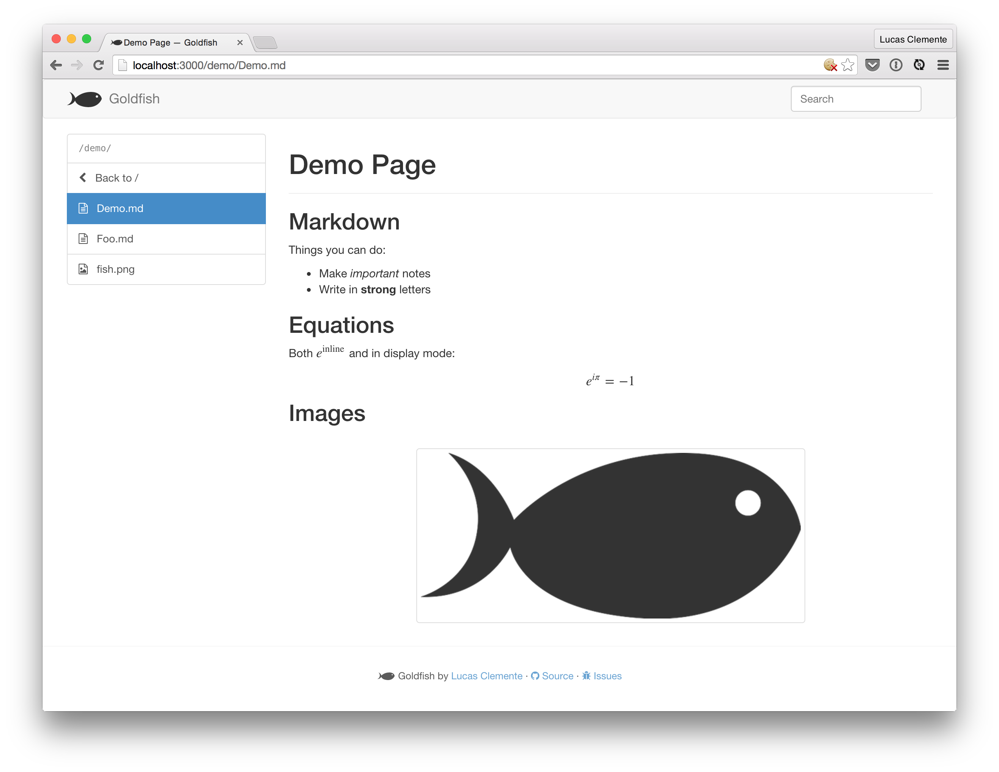

# Goldfish

A bring-your-own-editor personal wiki / notes blend powered by markdown and git.

Inspired by Evernote and gollum.

## Features

- Just files on your disk. Actually, a git repo on your disk.
- A server and a web-frontend, all in a single executable. The server manages files, your browser displays them.
- Files are markdown with some extensions:
  - LaTeX `$$\latex$$` or, if you want it on its own line, `\[ \latex \]`)
  - Easier links `[[foo]]`, also works for images `[[foo.png]]`
- If you change files on disk, they are automagically committed and updated in your browser.

Future features:

- Search
- Auto-push
- Auto-Update of folder listings (currently requires site reload)
- Windows support

## Usage

If you're on linux, make sure to install either `libinotifytools` or `inotifytools`.

```bash
# Or whatever path suits you
mkdir -p ~/goldfish
./goldfish ~/goldfish
```

Then open the folder in your favorite editor and start writing those markdown files :)

## Screenshot time!



Code for the page:

```markdown
# Demo Page

## Markdown

Things you can do:

- Make _important_ notes
- Write in __strong__ letters

## Equations

Both $$e^\text{inline}$$ and in display mode:

\[
  e^{i \pi} = -1
\]

## Images

[[fish.png]]

```
